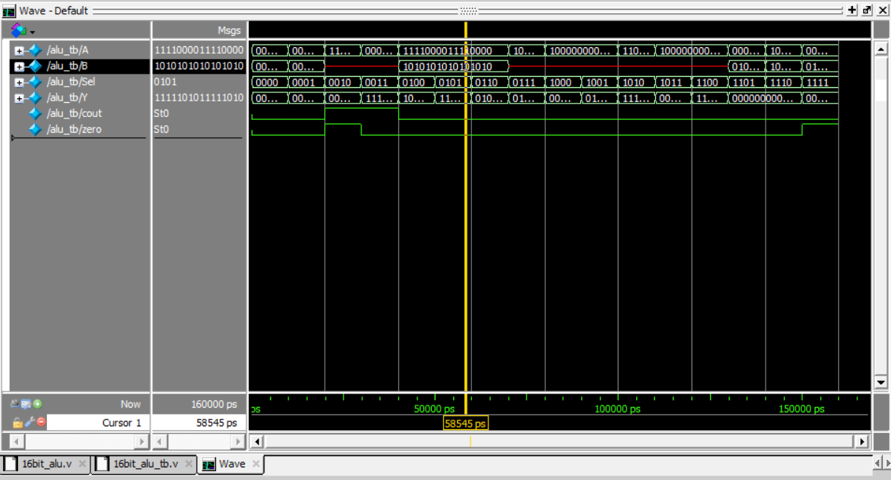

# 16-bit ALU in Verilog

A 16-bit Arithmetic Logic Unit (ALU) designed in Verilog and verified using a testbench in ModelSim. This project demonstrates foundational skills in digital logic design and RTL verification.

---

## ✨ Features

- **16-Bit Architecture:** Processes two 16-bit inputs.
- **16 Operations:** Supports a full set of arithmetic, logical, shift, and relational operations.
- **Status Flags:** Generates **Carry-Out** (`cout`) and **Zero** (`zero`) flags.
- **Verified Design:** Functionality was confirmed with a comprehensive testbench covering all 16 operations.

---

## 🛠️ ALU Operations Table

The 4-bit `Sel` input controls the ALU's function as follows:

| `Sel [3:0]` | Operation           | Description                |
|:-----------:|:--------------------|:---------------------------|
| `0000`      | `A + B`             | Addition                   |
| `0001`      | `A - B`             | Subtraction                |
| `0010`      | `A + 1`             | Increment A                |
| `0011`      | `A - 1`             | Decrement A                |
| `0100`      | `A & B`             | Bitwise AND                |
| `0101`      | `A | B`             | Bitwise OR                 |
| `0110`      | `A ^ B`             | Bitwise XOR                |
| `0111`      | `~A`                | Bitwise NOT                |
| `1000`      | `A << 1`            | Logical Shift Left         |
| `1001`      | `A >> 1`            | Logical Shift Right        |
| `1010`      | `A >>> 1`           | Arithmetic Shift Right     |
| `1011`      | `{A[14:0],A[15]}`   | Rotate Left                |
| `1100`      | `{A[0],A[15:1]}`    | Rotate Right               |
| `1101`      | `A < B`             | Set if Less Than (Unsigned)|
| `1110`      | `A == B`            | Set if Equal               |
| `1111`      | `0`                 | Clear (Reset Y to 0)       |

---

## 📊 Simulation Waveform

The following waveform from ModelSim confirms the correct functionality of the ALU across all test cases.

